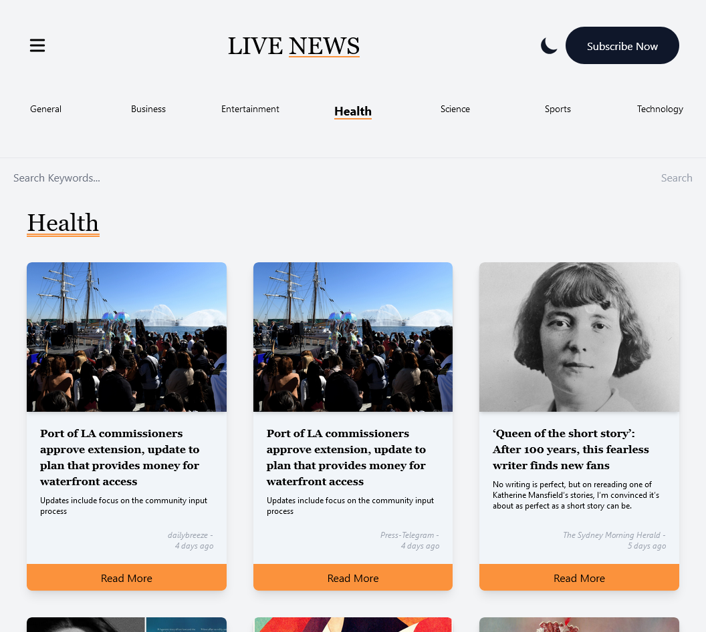
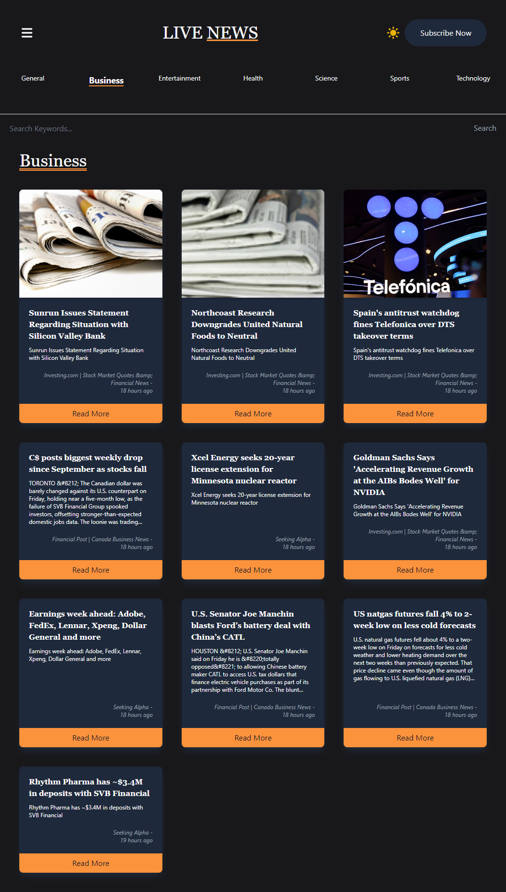

# Live News

A **Live News** application built with **NextJS** and **TailwindCSS** and using [MediaStack](https://mediastack.com/) API to fetch the latest news on certain topics or using the search input field.

[StepZen](https://stepzen.com/) was used in this project to introspects  **MediaStack** API endpoints and easily generate **GraphQL** schemas.

## Table of contents
- [Overview](#overview)
	- [Features](#features)
	- [Screenshot](#screenshot)
	- [Links](#links)
	- [Setup](#setup)
- [My process](#my-process)
	- [Built with](#built-with)
- [Author](#Author)

## Overview

### Features
**Users should be able to:**
- View the optimal layout for the site depending on their device's screen size 💻/ 📱
- Using the [mediastack](https://mediastack.com/) API you could search for the latest news 📰 
- Dark and Light Theme 🎨
- Using NextJS Revalidation for all genres at the top to minimize API calls and serve static pages 📃

### Screenshot



### Links
- Live Site URL: [Here](https://live-news-seven.vercel.app/)
- GitHub URL: [Here](https://github.com/MohanadOO/live-news) 

### Setup

Using yarn 👇
```
$ yarn
$ yarn dev
```

Using NPM👇
```
$ npm install
$ npm run dev
```

## My process

### Built with
- [React](https://reactjs.org/) - JS library
- [Tailwind CSS](https://tailwindcss.com/) - CSS framework
- [React Icons](https://react-icons.github.io/react-icons/) - React icons provides a huge collections of icons from different sources.
- [GraphQL](https://graphql.org/) - A query language for your API

## Author
- Website - [Mohanad Portfolio](https://www.mohanad.in/)
- Twitter - [@MohanadOO_](https://twitter.com/MohanadOO_)
